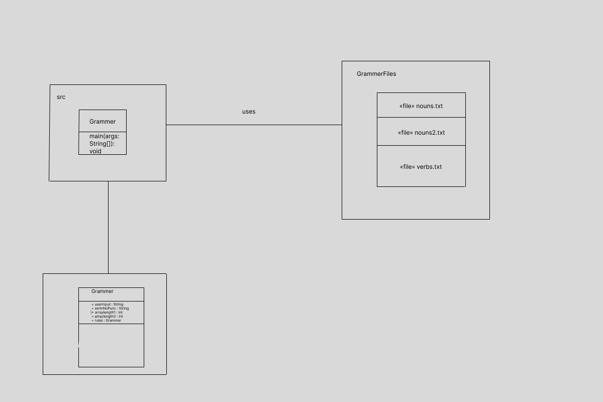

# Emu
tresurent, brandonrachal9021, darion17, jonn3

#2 Java - Grammer Checker (https://github.com/GTTeric/GrammarChecker)

## Other Repositories
#1 Python - Protect from Plaigiarism (https://github.com/aks060/ProtectFromPlagiarismChecker) Team Egret selected this repo before you updated your README.
#3 Python - Amazon Scrapper (https://github.com/sarthakbatragatech/AmazonScrapper)
#4 Java - Document Classification (https://github.com/RodneyShag/DocumentClassification)
#5 Python - IMDB Top 50 Scrapper (https://github.com/nishantsahoo/IMDB_Top50_Scrape)  Team Elk selected this repo before you updated your README.
#6 Java - Sorting Visualizer (https://github.com/VarunIrani/sorting-visualizer-java)

#Branding Images

